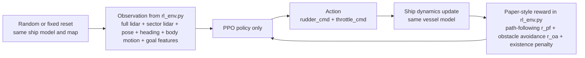
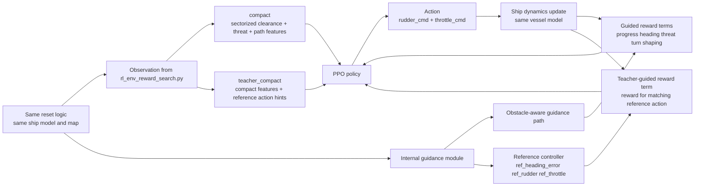
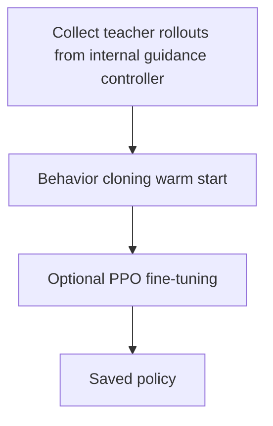

# ASV RL Method Flow

This note compares the original `rl_env.py` training pipeline with the newer reward-search pipeline in `rl_env_reward_search.py`.

## 1. Original `rl_env.py` Pipeline

### What this means

- The policy learns directly from a fairly rich observation.
- The reward is relatively simple and generic.
- There is no internal planner and no teacher signal.
- Training is PPO-only.

## 2. Reward-Search Pipeline

### What this means

- The simulator is still the same base environment.
- The observation is more structured around what matters for collision avoidance.
- The reward is denser and more specific than the original paper-style blend.
- In `teacher_guided`, the environment computes a local reference action and uses it to guide learning.

## 3. Training Difference

### Compared to the original approach

- Original: `PPO` starts from scratch.
- New strongest method: `behavior cloning warm start` + `optional PPO fine-tune`.
- New deployable method: `compact_teacher_guided`.
- New strongest sim-only method: `teacher_compact_guided`.

## 4. Realistic vs Privileged Inputs

### Closest to the real vessel

- `compact_teacher_guided`
- Uses LiDAR-derived clearance/threat features plus pose-derived quantities such as heading error, speed, and yaw-rate.

### Stronger but privileged in simulation

- `teacher_compact_guided`
- Adds `ref_heading_error`, `ref_rudder`, and `ref_throttle`.
- These are not extra hardware sensors.
- They come from an onboard guidance computation inside the environment.

## 5. Key Takeaway

The original method asks PPO to discover avoidance behavior mostly by itself from a broad observation and a simple reward.

The newer method keeps the same ASV simulator but makes learning easier by:

- compressing the observation into more decision-relevant features,
- adding denser reward shaping,
- and, in the best variants, giving PPO a teacher-guided starting point.
